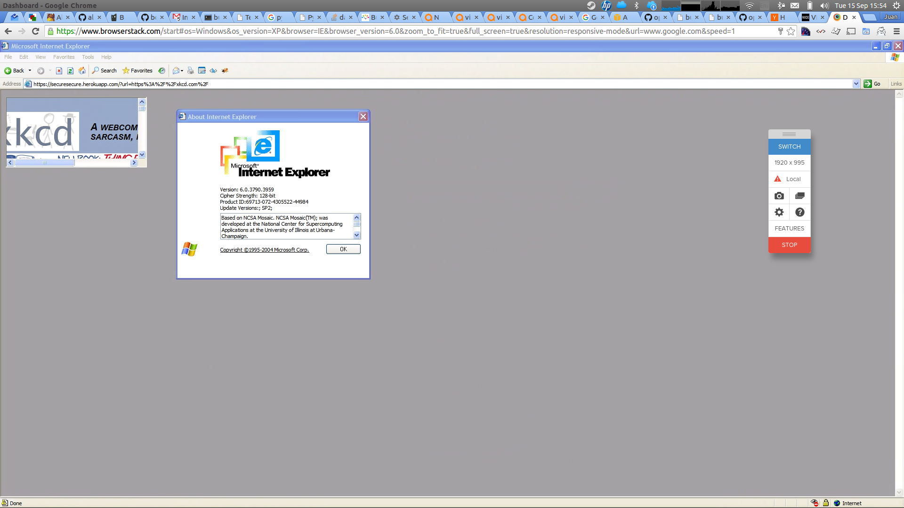
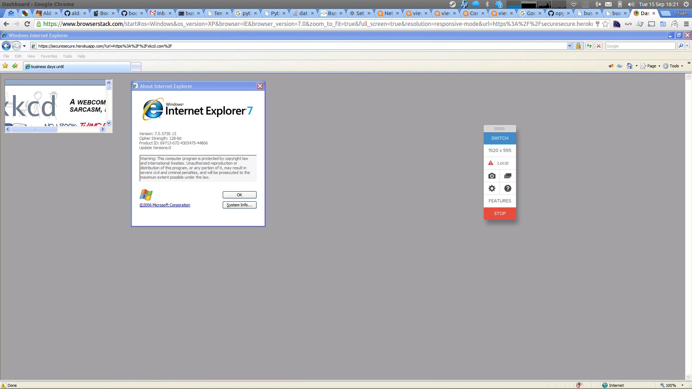
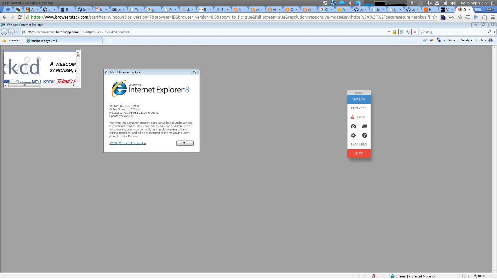
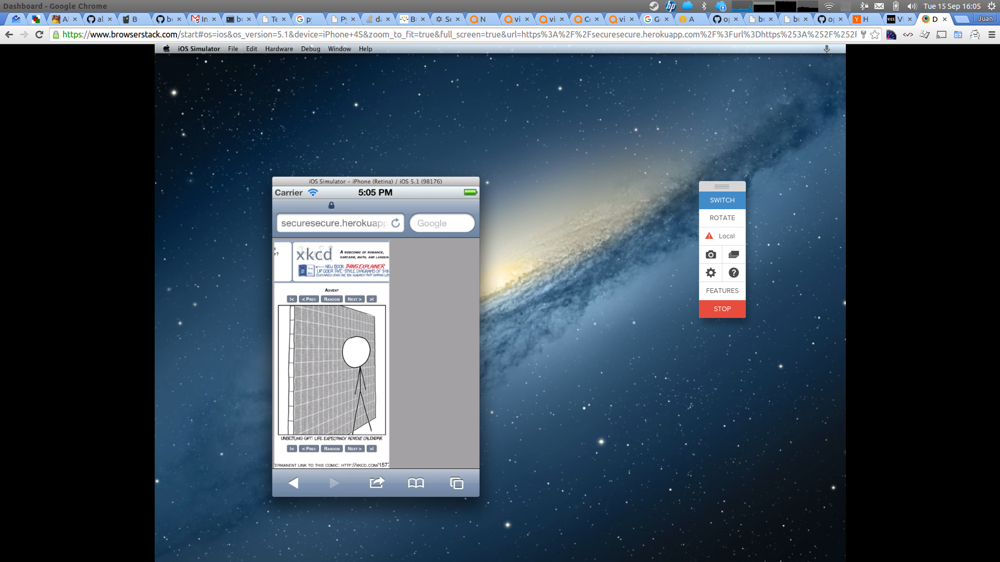

A quick test to check if a secure container page can contain an IFRAME which loads another secure page, using IE 6, 7 and 8, and also Safari on iPhone 4S.

# IE6

# IE7

# IE8

# Safari on iPhone4S

